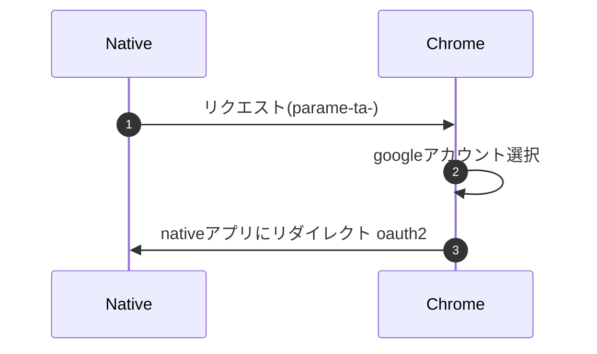

## OAuth
複数のWebサービスを連携して動作させる仕組み
利用ユーザーの多いサービスはOauth認証を提供している事が多い。
別サービスで入力した情報を再度入力する必要がないので新規登録の抵抗が少なくなる
認証ではなく認可の仕組み
自家サーバーに認証の仕組みを持たせる必要がなくなる

## OAuth2.0
Oauth1.0はwebアプリ以外のユースケースを考慮していなかった。
Oauth2.0ネイティブアプリでも使えるらしい。

## はてな
事前にアプリケーションのOAuthに対応しているサービスの方で登録しておく必要あり。
登録する内容はアプリケーションに紐づいた認可情報？
アプリケーション側で受け取った認可コードを使って速やかにアクセストークンと交換

このoauthは何がよいの？
→ toC向けで使われるんじゃないかな？
→ フローの意味もしっておきたい

## 参考資料
https://hogetech.info/security/sso/oauth2
https://qiita.com/TakahikoKawasaki/items/e37caf50776e00e733be
https://contents.saitolab.org/oauth/
https://qiita.com/nobuo_hirai/items/8cd8140e7d3970e4e094
https://qiita.com/nobuo_hirai/items/f69f4781a0fe50e4cbf8