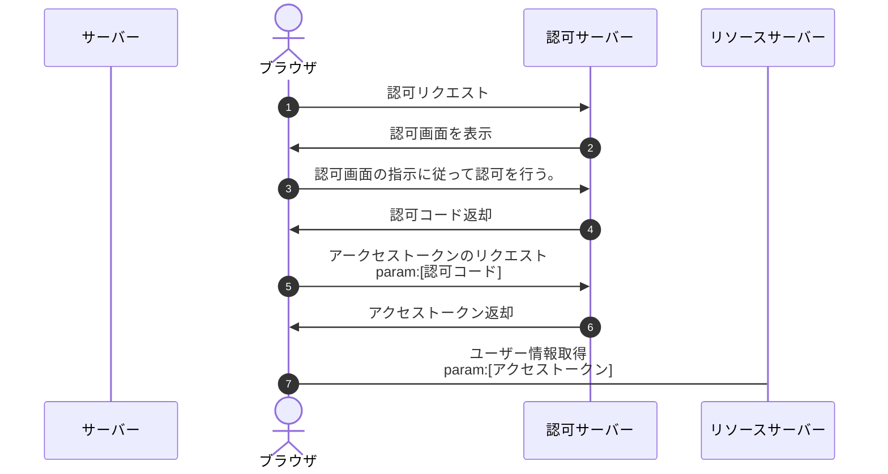

```mermaid
sequenceDiagram
	autonumber
    participant server as サーバー
    actor browser as ブラウザ
    participant auth_s as 認可サーバー
    participant resource_s as リソースサーバー
	browser->>auth_s: 認可リクエスト
    auth_s->>browser: 認可画面を表示
    browser->>auth_s: 認可画面の指示に従って認可を行う。
    auth_s->>browser: 認可コード返却
    browser->>auth_s: アークセストークンのリクエスト<br>param:[認可コード]
    auth_s->>browser: アクセストークン返却
    browser->resource_s: ユーザー情報取得<br>param:[アクセストークン]
```